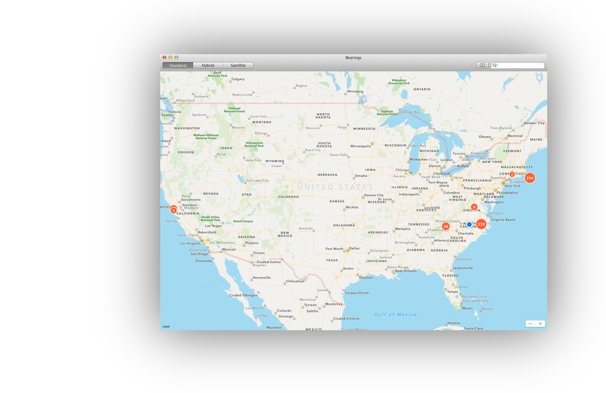
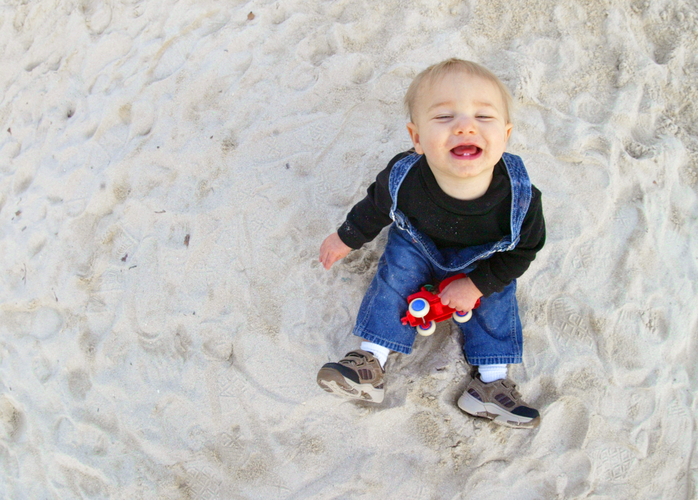
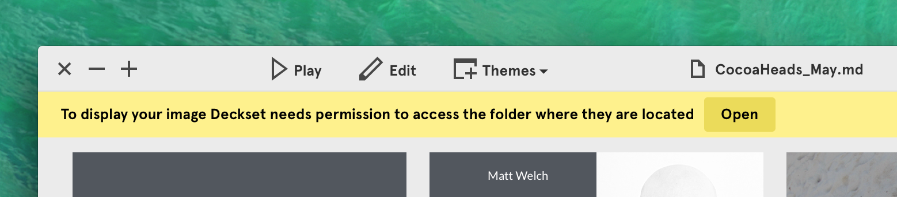
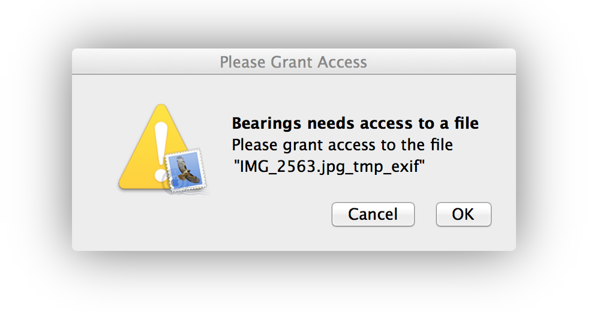
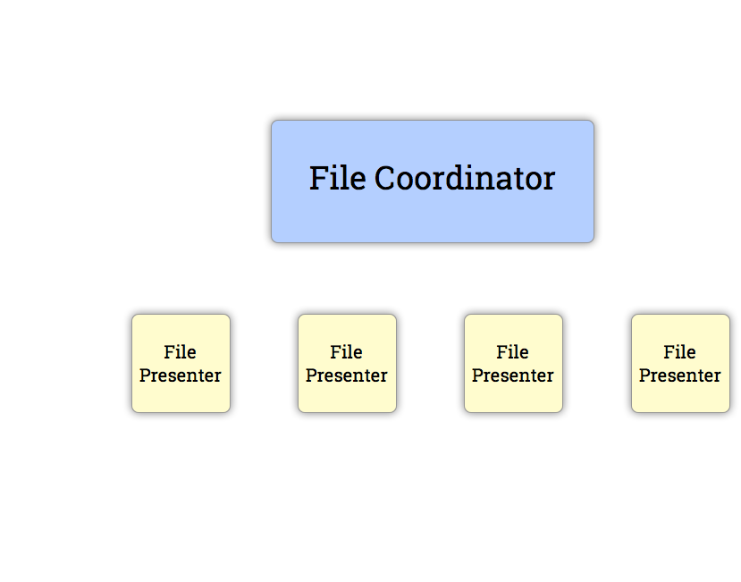
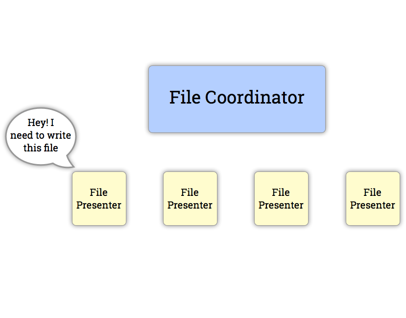
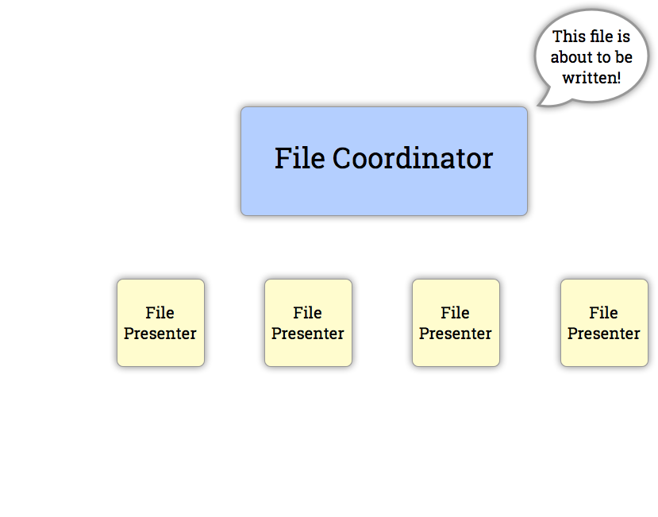
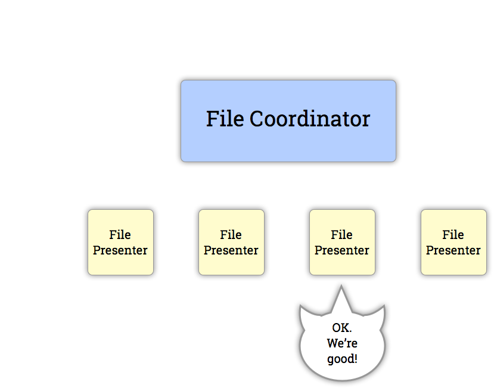
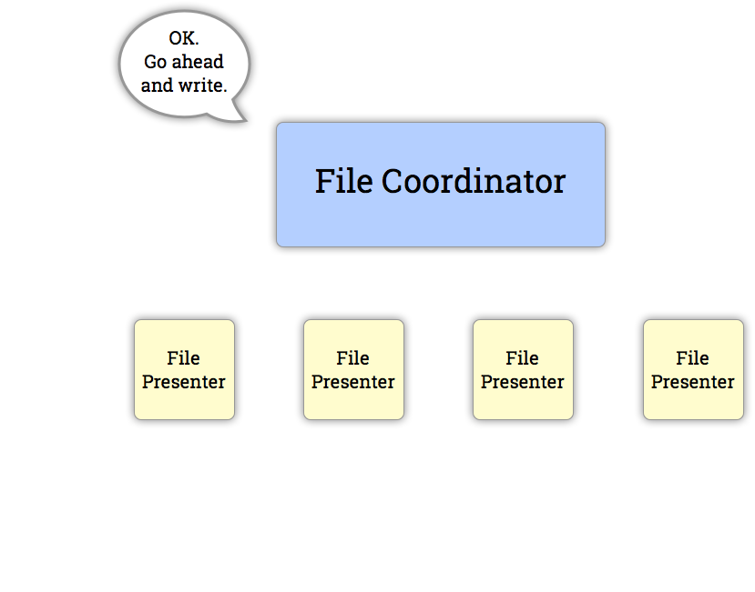
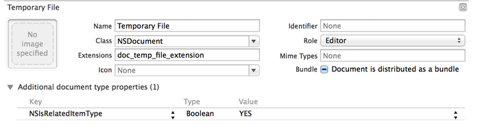

# **Escaping the**
# **Mac App Sandbox**
## \(or at least a small part of it\)
^
These are my notes

---

# Matt Welch


Developer working on iOS, Mac, and node apps by night, and on the Force.com platform by day.

matt@welcher.net
@\_MattWelch\_
http://mattwel.ch

^
I'm me. Work here in Durham at the American Underground at Wired Triangle.

---

# Bearings


---

# What is the Mac App Sandbox?


---

**App Sandbox** is an access control technology provided in OS X, enforced at the kernel level. Its strategy is twofold:

- App Sandbox enables you to describe how your app interacts with the system. The system then grants your app the access it needs to get its job done, and no more.
- App Sandbox allows the user to transparently grant your app additional access by way of Open and Save dialogs, drag and drop, and other familiar user interactions.

(From the Apple "App Sandbox Design Guide")


^
When you build an app, you ask for certain permissions from the sandbox entitlement (like Location, or Contacts, or Camera)
Sandboxing forces user to grant explicit access to files or directories

---

# Sandbox Filesystem Limitations
Specifically, sandboxing limits an app to only those files or directories explicitly opened by the user.

For most cases this is OK. (In fact, Deckset here regularly asks permission to access a photo I want to use that's on my filesystem.)



^
Maybe show a demo of deckset asking for permissions.

---

# Temporary Files


The problem is that temporary files are supposed to be invisible to the end user.

What kind of experience would this be?

Now multiply this bad experience by 10. Or 100. Or however many hundreds of photos (in the case of Bearings app) that need to be processed.

---

# Workaround: File Presenters
### File Presenters?


---

## Yes, File Presenters.
- Around since 10.7, File Presenters (and their "parents" File Coordinators) have made working with the file system in a multi-threaded, multi-processing environment easier and safer.


---

## Yes, File Presenters.
- Around since 10.7, File Presenters (and their "parents" File Coordinators) have made working with the file system in a multi-threaded, multi-processing environment easier and safer.


---

## Yes, File Presenters.
- Around since 10.7, File Presenters (and their "parents" File Coordinators) have made working with the file system in a multi-threaded, multi-processing environment easier and safer.


---

## Yes, File Presenters.
- Around since 10.7, File Presenters (and their "parents" File Coordinators) have made working with the file system in a multi-threaded, multi-processing environment easier and safer.


---

## Yes, File Presenters.
- Around since 10.7, File Presenters (and their "parents" File Coordinators) have made working with the file system in a multi-threaded, multi-processing environment easier and safer.


---

# Implementing File Presenters for Related Items
Apple has repurposed File Presenters to enable "Related Items" in sandboxed apps.

**Related Items**

* Must have the same name (minus extension) as the item to which they are related
* Must have a known-ahead-of-time extension

^
Point out that as-designed reason for related files is for things like opening subtitle files for movies, or for an sqlite journal file

---

# Implementing File Presenters for Related Items
Create a class that conforms the the `NSFilePresenter` protocol. Implement these methods:

1. `primaryPresentedItemURL` – The URL for the original file
1. `primaryItemURL` – the URL for the temporary file (the same as above, but with different extension)
1. `presentedItemOperationQueue` – the queue on which the app will perform file presentation tasks

^
The queue is simply a new `NSOperationsQueue`

---

### WRFilePresenter
```objectivec
//  WRFilePresenter.m
//  Bearings
//
//  Created by Matt Welch on 3/17/14.
//

#import "WRFilePresenter.h"

@implementation WRFilePresenter
{
    NSOperationQueue* queue;
    NSURL* pFileURL;
    NSURL* tFileURL;

}

- (id) init {
    self = [super init];
    if (self) {
        queue = [NSOperationQueue new];
        [NSFileCoordinator addFilePresenter:self];
    }
    return self;
}

- (NSURL*) primaryPresentedItemURL {
    return pFileURL;
}

- (NSURL *) presentedItemURL {
    return tFileURL;
}

- (NSOperationQueue*) presentedItemOperationQueue {
    return queue;
}

-(void) setURLs:(NSURL*)url {
    pFileURL=url;
    NSString *fURLS=[url absoluteString];
    NSString *fURLSt=[NSString stringWithFormat:@"%@%@",fURLS,@"_temp_file_extension" ];

    NSURL *surl = [NSURL URLWithString:fURLSt];

    tFileURL=surl;
}

@end
```

^
We get the temporary file name by appending _temp_file_extension to the real url

---

# Implementing File Presenters
Given a file with a url of `realFileURL`, implement a presenter for it:

```objectivec
WRFilePresenter *filePresenter=[[WRFilePresenter alloc] init];
[filePresenter setURLs:realFileURL];
```
And we're all set

---

# XCode Target Setup
In the Project Navigator, under the "Info" tab, there is a "Documents Type" section.

- Set "Extension" to be the known temporary file extension.
- Add `NSIsRelatedItemType` of type `Boolean` to "Additional document type properties" and set it to `YES`

---

# XCode Target Setup



---

# Demo


---

# Further Information
More in-depth information can be found at:
http://mattwel.ch/temporary-files-in-sandboxed-mac-apps/


This presentation is on github:
https://github.com/mattwelch/mac\_sandbox\_tempfiles\_deckset

---

## Attributions
- happiness from a sandbox - https://www.flickr.com/photos/celinesphotographer/326629023/
- App Sandbox Design Guide - https://developer.apple.com/library/mac/documentation/Security/Conceptual/AppSandboxDesignGuide/AboutAppSandbox/AboutAppSandbox.html
- Paperama - https://www.flickr.com/photos/kasaa/3103799093/